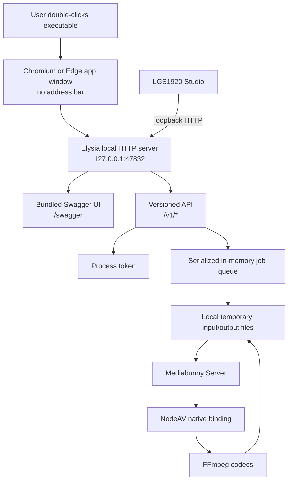
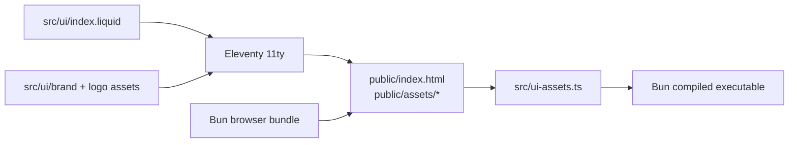

# LGS1920 Encoder architecture

## Scope

LGS1920 Encoder is a local desktop service for video export. The user launches one executable. The executable starts an Elysia HTTP server on `127.0.0.1`, opens a local application window, and owns the complete encoding lifecycle.

The loopback address is part of the security boundary. `ENCODER_HOST` is rejected when it is anything other than `127.0.0.1`. The service does not accept remote media URLs, does not contain a cloud upload client, and does not send telemetry.

## Runtime topology

The dashboard and Swagger UI are bundled into the executable. Their scripts and styles are served by the same local process, so opening the dashboard does not require a network connection. Swagger's OpenAPI JSON is exposed at `/swagger/openapi.json`.

## Process lifecycle

1. `src/index.ts` reads environment configuration and creates the temporary data directory.
2. A bounded logger and a serialized job manager are created.
3. `createApp()` registers the local routes, the OpenAPI generator, the dashboard, and the bundled Swagger assets.
4. Elysia listens on the configured loopback port. The port can change when `ENCODER_PORT` is set.
5. The launcher searches the `PATH` and standard installation directories for Edge, Chrome, Chromium, Brave, Vivaldi, or Opera and opens `--app=http://127.0.0.1:<port>` with a dedicated local browser profile by default. App mode removes the browser navigation controls and keeps the window separate from the user's normal browser session. `ENCODER_WINDOW_MODE=browser` opens a normal browser window instead.
6. Studio or the dashboard requests a process-scoped token from `/v1/session` and uses it for protected routes.
7. The process exits when the executable is closed. The in-memory job list and logger then disappear.

The application window is implemented with the installed Chromium-compatible browser in app mode. This keeps the executable Bun-only while removing browser navigation controls. Browser mode remains available for standard browser decorations. A future native shell can keep the same HTTP contract.

## API layers

### Public service routes

- `GET /v1/health` reports process identity, version, local-only status, port, and codec capabilities.
- `GET /v1/session` returns the token generated for the current process.
- `GET /swagger` serves the local Swagger UI.
- `GET /swagger/openapi.json` returns the generated OpenAPI document.

The health and session routes verify the request origin when an `Origin` header is supplied. The CORS allow-list defaults to the local Studio development origins and the LGS1920 Studio origins. The dashboard's own loopback origin is always accepted, including both `127.0.0.1` and `localhost` on the configured encoder port, so browser uploads from the bundled UI work correctly.

### Protected job routes

All job and log routes require `Authorization: Bearer <process-token>`.

- `POST /v1/jobs` accepts either a multipart media file or a JSON frame-job declaration.
- `POST /v1/jobs/:id/frames` accepts ordered raw RGBA frames for a frame job.
- `POST /v1/jobs/:id/complete` closes a frame job and starts its MP4 encoding.
- `GET /v1/jobs` lists the public state of all jobs.
- `GET /v1/jobs/:id` returns one public job state.
- `GET /v1/jobs/:id/events` streams state changes as server-sent events.
- `DELETE /v1/jobs/:id` cancels queued or active work.
- `GET /v1/jobs/:id/output` streams the completed local MP4. The dashboard requests it with the process token, creates a local object URL, and starts the download from the browser.
- `GET /v1/logs` returns the bounded local activity log.

The API keeps internal file paths private. The public job object contains status, progress, timestamps, options, errors, and the output route, while the output file itself remains controlled by the process.

## Encoding pipeline

`src/jobs.ts` serializes jobs so the prototype has one active conversion at a time. A submitted `File` is written to a temporary input path. Frame jobs append fixed-size raw RGBA frames to a temporary input path and wait for the complete route. The queue calls `src/encoding.ts`, which creates a Mediabunny `Conversion` for media files or a `VideoSampleSource` for individual frames, using the NodeAV-backed output. Progress callbacks update the public job state and logger.

File jobs output MP4 with AVC video and AAC audio. Frame jobs output MP4 with AVC video and no audio track. The quality setting selects the video bitrate, `durationSeconds` trims from the beginning of file inputs, and the acceleration preference is passed to the conversion. An abort signal cancels an active conversion. Temporary input and output cleanup is performed by the job manager according to the job terminal state.

## UI and asset pipeline

Eleventy generates the document from the Liquid template. Bun bundles the TypeScript dashboard and CSS. `src/ui-assets.ts` imports the generated files as text, including the LGS1920 icon and local Swagger UI assets. The server then serves these embedded values, allowing a compiled executable to run without a project directory.

The dashboard uses the LGS1920 Web Awesome base theme copied from Studio. Its persisted local preferences include color mode and brand color. The frame demo is a separate `encoder-frame-demo` application on `47833`; its **Test Frame API** dialog creates PNG or JPEG images in the browser, converts them to RGBA with Canvas, and exercises the protected frame-job routes on the independent encoder server at `47832`. The comparison dialog synchronizes playback and seeking for both videos through a shared Web Awesome timeline slider.

## Windows native binding packaging

Mediabunny Server depends on NodeAV. NodeAV normally resolves its platform `.node` package at runtime. A compiled Bun executable uses a virtual filesystem, so the Windows build cannot rely on that dynamic lookup.

`scripts/build-windows.ts` performs these steps:

1. Find the installed NodeAV version.
2. Use the locally installed `@seydx/node-av-win32-*` package when available.
3. Otherwise download its archive directly from the package registry with Bun's `fetch` API and extract `node-av.node` with Bun's gzip API and a small tar reader.
4. Temporarily patch NodeAV's binding loader to import that exact native file.
5. Compile the Windows target so Bun embeds the addon.
6. Restore the dependency file and remove the staging directory.

No package manager command is used by the Windows build. The icon metadata is applied when the compilation runs on Windows. Linux cross-compilation still creates a working executable, but Bun cannot write Windows icon metadata from Linux.

## Security and privacy model

- The server binds to loopback only.
- Protected routes require a token generated per process by default.
- CORS is restricted to configured origins.
- The dashboard and Swagger UI use local assets and a same-origin content policy.
- Uploaded files are written to the configured local temporary directory.
- The input file is never resolved from a URL.
- Job state and logs are in memory and are cleared when the process exits.

The token is a local process boundary, not a replacement for operating-system account security. Any local process able to read the configured token or call the loopback port can interact with the service.

## Build and extension points

Use [RELEASES-AND-VERSIONS.md](RELEASES-AND-VERSIONS.md) for release channels, semantic versions, platform artifacts, and the Bun-only publication workflow. The main extension points are:

- add a route and schema in `src/app.ts`;
- add a job state transition in `src/jobs.ts`;
- add a conversion option in `src/types.ts` and `src/encoding.ts`;
- add a dashboard control in `src/ui/index.liquid` and its behavior in `src/ui/main.ts`;
- update the generated UI asset imports when adding a new embedded file.

The API contract is intentionally independent from the dashboard, so Studio can use the same local service while the UI evolves.
