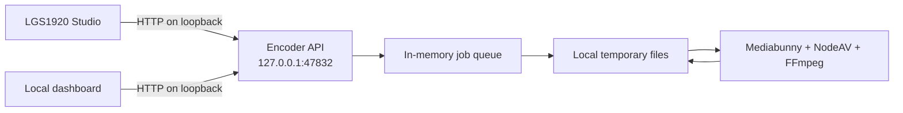

# LGS1920 Encoder: explanation and usage

## Purpose

LGS1920 Encoder is a desktop-oriented local service for video export. It is intended to be launched by the user and then controlled by LGS1920 Studio or by the bundled local dashboard.

The service has no remote media pipeline. A media file selected in the dashboard or supplied by Studio is sent to `127.0.0.1`, written to a temporary file on the same computer, encoded with Mediabunny, and returned through the same loopback interface.

## Architecture



The server binds only to `127.0.0.1`. Configuration rejects another host value, so the application cannot accidentally expose the encoding API on the local network through this configuration path.

The dashboard is served by the same process. Its HTML is rendered by Eleventy from `src/ui/index.liquid`, while its JavaScript and CSS are bundled locally with Bun. The LGS1920 square mark and Encoder icon are copied as local Eleventy passthrough assets. Swagger UI is also embedded and served locally at `/swagger`; the dashboard additionally allows the Font Awesome icon endpoint used by Web Awesome. When the executable starts, it opens a dedicated Chromium-compatible application window without navigation controls. Set `ENCODER_WINDOW_MODE=browser` to use a normal browser window.

## Starting the application

For development, install Bun and run:

```bash
bun install
bun run start
```

The dashboard opens at:

```text
http://127.0.0.1:47832/
```

The application stays active in the process that was launched. A packaged executable can be launched by double-clicking it. The Windows build hides the console window. The current prototype does not yet install itself as a system tray service or register an operating system auto-start entry.

## Using the dashboard

1. Open the local dashboard.
2. Select a local video or audio file in **Input media**.
3. Choose a quality and hardware acceleration preference.
4. Optionally enter an even output width and height between 2 and 7680.
5. Select **Start encoding**.
6. Follow the current job card, the jobs table, and the activity log.
7. Select the download action when the job reaches **completed**. The dashboard fetches the MP4 with its local session token and starts the browser download.

The dashboard refreshes jobs and log entries every second. The progress bar is reported by Mediabunny's conversion callback. Jobs and logs are held in memory and disappear when the encoder process exits.

The header includes compact site-style menus for the LGS1920 color mode and brand color. Preferences are kept in the browser's local storage and never sent to the encoder API. The dashboard focuses on local jobs and synchronized video comparison. The independent `encoder-frame-demo` application runs at `http://127.0.0.1:47833/`; its **Test Frame API** dialog creates ten PNG or JPEG images in the browser, converts them to RGBA with Canvas, shows every API call, and encodes a five-second MP4 through the server on `47832`.

## API usage

The health route requires no token and can be used by Studio to detect the local service:

```http
GET /v1/health
```

Obtain the process-scoped bearer token:

```http
GET /v1/session
```

Create a job with a multipart request. The `file` field is required. The `options` field is an optional JSON object:

```bash
curl http://127.0.0.1:47832/v1/session
curl -X POST http://127.0.0.1:47832/v1/jobs \
  -H 'Authorization: Bearer YOUR_TOKEN' \
  -F 'file=@input.webm' \
  -F 'options={"quality":"high","width":1920,"durationSeconds":5}'
```

The job response contains an identifier and the initial `queued` status. Use the following routes to manage the job:

| Route | Purpose |
| --- | --- |
| `POST /v1/jobs` | Create a media-file job or a frame job |
| `POST /v1/jobs/:id/frames` | Append one ordered raw RGBA frame |
| `POST /v1/jobs/:id/complete` | Close a frame job and start encoding |
| `GET /v1/jobs` | List jobs |
| `GET /v1/jobs/:id` | Read one job |
| `GET /v1/jobs/:id/events` | Receive server-sent progress events |
| `GET /v1/jobs/:id/output` | Download the completed MP4 |
| `DELETE /v1/jobs/:id` | Cancel a queued or active job |
| `GET /v1/logs` | Read local service and job logs |

The interactive API reference is available at `http://127.0.0.1:47832/swagger`. The generated OpenAPI JSON is at `/swagger/openapi.json`.

### Sending individual frames

The frame API accepts one raw RGBA frame per request. The body must contain exactly
`width * height * 4` bytes, with four bytes per pixel in RGBA order. Width and
height must be even. Frames must be sent in order with zero-based indexes.

Create a five-second job containing ten frames at two frames per second:

```bash
curl -X POST http://127.0.0.1:47832/v1/jobs \
  -H 'Authorization: Bearer YOUR_TOKEN' \
  -H 'Content-Type: application/json' \
  -d '{"type":"frames","width":16,"height":16,"frameRate":2,"frameCount":10,"options":{"quality":"low","hardwareAcceleration":"no-preference"}}'
```

The response contains the job identifier. Send each raw frame with its index:

```bash
curl -X POST http://127.0.0.1:47832/v1/jobs/JOB_ID/frames \
  -H 'Authorization: Bearer YOUR_TOKEN' \
  -H 'Content-Type: application/octet-stream' \
  -H 'X-Frame-Index: 0' \
  --data-binary @frame-0000.rgba
```

After the expected number of frames has been received, close the input and start
encoding:

```bash
curl -X POST http://127.0.0.1:47832/v1/jobs/JOB_ID/complete \
  -H 'Authorization: Bearer YOUR_TOKEN'
```

`GET /v1/jobs/:id` and `GET /v1/jobs/:id/events` return the progress fields:

| Field | Meaning |
| --- | --- |
| `phase` | `receiving`, `queued`, `encoding`, or a terminal phase |
| `receivedFrames` | Number of frames accepted by the API |
| `frameCount` | Number of frames expected |
| `progress` | Overall value from `0` to `1`; upload uses `0` to `0.5`, encoding uses `0.5` to `1` |

For browser capture, `CanvasRenderingContext2D.getImageData(...).data` can be
sent directly as the request body. Do not send PNG or JPEG data to this endpoint;
convert it to RGBA bytes first.

Protected routes require:

```http
Authorization: Bearer YOUR_TOKEN
```

The token is generated again each time the process starts unless `ENCODER_TOKEN` is provided. It is never written to the media output.

## Configuration

Copy `.env.example` to `.env` for development. The supported settings are:

| Variable | Default | Description |
| --- | --- | --- |
| `ENCODER_HOST` | `127.0.0.1` | Must remain the loopback address |
| `ENCODER_PORT` | `47832` | Local HTTP port |
| `ENCODER_DATA_DIR` | System temporary directory | Temporary input and output files |
| `ENCODER_MAX_UPLOAD_BYTES` | `1073741824` | Maximum accepted upload size |
| `ENCODER_TOKEN` | Generated per process | Optional fixed local integration token |
| `ENCODER_ALLOWED_ORIGINS` | Local Studio and public Studio origins | Browser origins allowed by CORS; the bundled dashboard origin is added automatically |
| `ENCODER_OPEN_DASHBOARD` | `true` | Open the local dashboard at startup |
| `ENCODER_WINDOW_MODE` | `app` | Launch a separate application window, or use `browser` for a normal browser window |

The temporary input is deleted when a job finishes, fails, or is canceled. A completed output remains available for the lifetime of the process.

## Packaging

Build the dashboard assets and a standalone executable with one of the target scripts:

```bash
bun run build:windows
bun run build:windows-arm64
bun run build:macos
bun run build:macos-x64
bun run build:linux
bun run build:linux-arm64
```

`bun run build:ui` runs Eleventy first and then bundles the dashboard JavaScript and CSS. The Windows icon source is `src/ui/assets/logo/lgs1920-encoder-icon.ico`; a native Windows build writes it into the `.exe` metadata.

Bun's executable compiler supports target platforms and the Windows build can hide the console window. The Windows build script embeds the matching MSVC NodeAV `.node` binding in the executable. This step is necessary because NodeAV normally resolves its platform package dynamically, while a compiled Bun executable runs from a virtual filesystem. When the requested Windows binding is not installed locally, the script downloads its archive with Bun's registry and gzip APIs. The LGS1920 Encoder `.ico` is added to the executable when the compilation runs on Windows; Bun does not apply Windows icon metadata during Linux cross-compilation.

See [Architecture](ARCHITECTURE.md) for the complete process and asset pipeline. See [Releases and versions](RELEASES-AND-VERSIONS.md) for the publication workflow and the meaning of each version and platform artifact.

## Troubleshooting

### The dashboard says that the encoder is offline

Confirm that the encoder process is running and that the dashboard was opened from the same local service at `http://127.0.0.1:47832/`. Check whether another process already uses the configured port.

### The Windows executable closes immediately

Rebuild it with `bun run build:windows`. Older Windows executables may have been built without the Windows NodeAV native binding and fail with `Could not load the node-av native binding for win32-x64`. The corrected build embeds this binding and produces `dist/encoder.exe`.

### A job fails immediately

Inspect the activity log for the job error. Confirm that the input file is readable and that its size is below `ENCODER_MAX_UPLOAD_BYTES`. Mediabunny supports many input formats, but the prototype always writes MP4 with AVC video and AAC audio.

### Hardware acceleration is unavailable

Use **Prefer software** to force a software path. Hardware support depends on the graphics device, operating system drivers, and the FFmpeg build available to NodeAV.

## Privacy boundary

The application has no route for remote media URLs, no cloud upload client, no telemetry client, and no external dashboard dependency. The API host is validated as loopback-only, and the dashboard and Swagger content policies restrict network requests to the local origin.
